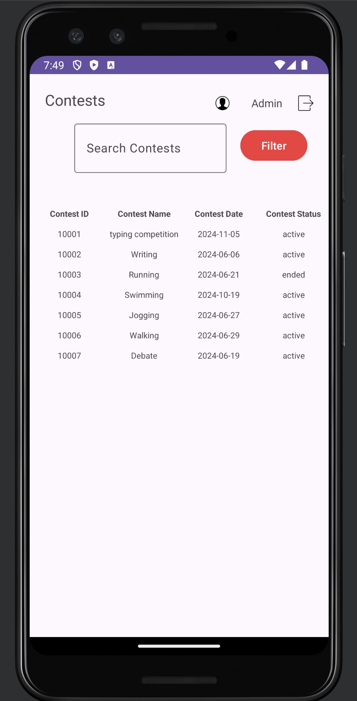
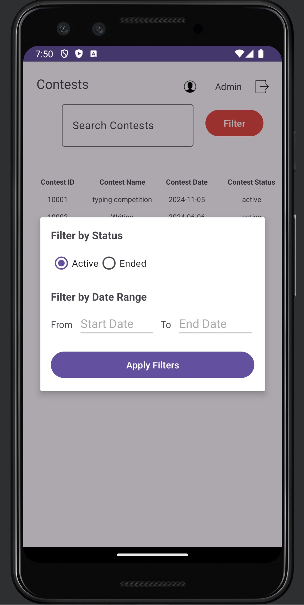
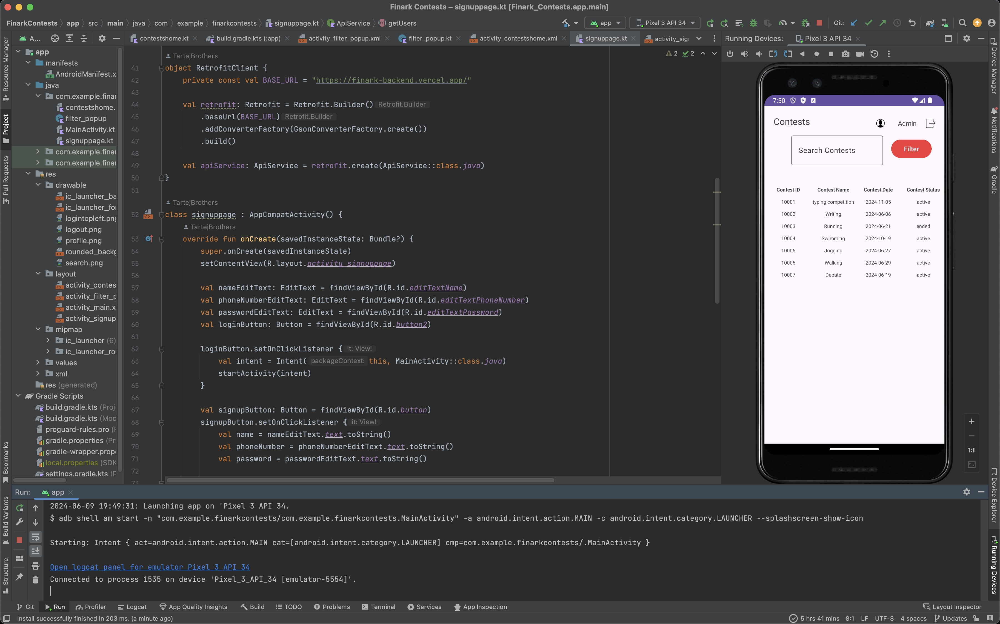

# Finark-Android

## General Information

This Android app utilizes an Express API to display contests in a tabular format and enables users to create accounts and log in.

## Technologies Used

- XML
- Kotlin
- Android Studio
- Retrofit

## API

- [Contests API](https://finark-backend.vercel.app/api/contest)
- Endpoint: `/api/contest`

## Working

## Screenshots

## Contact

Feel free to reach out to the developer on [LinkedIn](https://www.linkedin.com/in/tartej).
