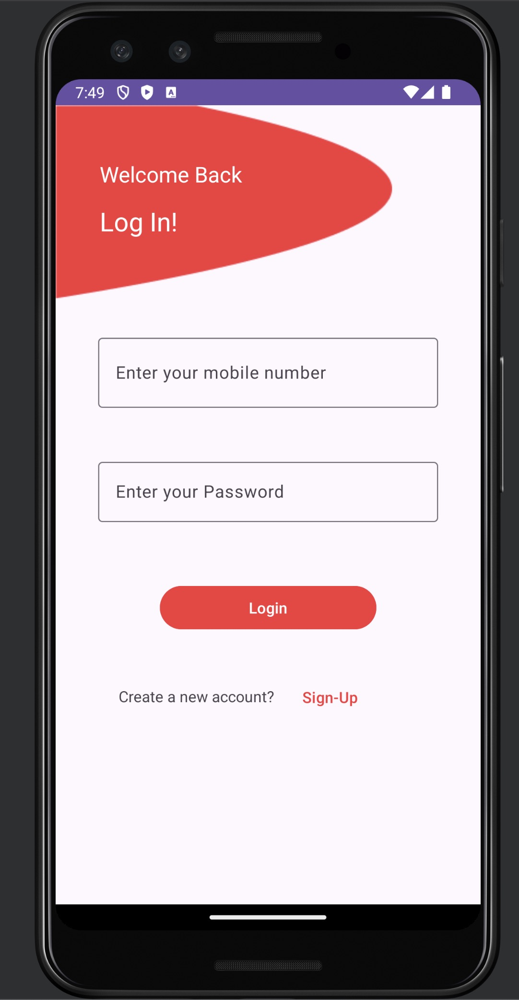

# Finark-Android

---

## General Information

---

- This Android app uses the API created using Express and displays the contests in a Tabular format and allows the user to create account and login.

## Technologies Used

---

- XML
- Kotlin
- Android Studio
- Retrofit

## API

---

- [API Link For Contests](https://finark-backend.vercel.app/api/contest)
- `/api/contest`

## Working

---

## Screenshots

---

## Contact

---

